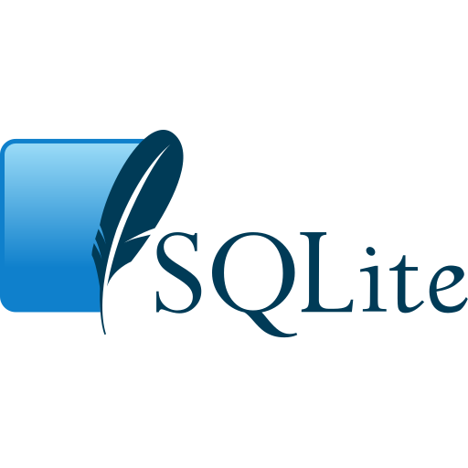
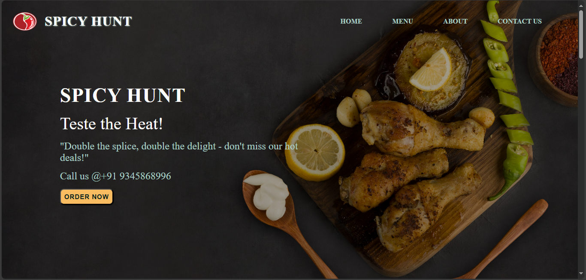

<h1>
  B&nbsp;A&nbsp;L&nbsp;A&nbsp;J&nbsp;I&nbsp;&nbsp;
  
</h1>

<h3>Python Full Stack Developer</h3>

> I build modern web applications and love to solve real-world 
>problems with code.

[Theni, Tamil Nadu](https://www.google.com/maps/search/Theni,+Tamil+Nadu,+India) &nbsp;&nbsp;&nbsp;&nbsp;&nbsp;&nbsp;|&nbsp;&nbsp;&nbsp;&nbsp;&nbsp;&nbsp;
[Portfolio](https://myportfolio-sigma-one-32.vercel.app/) &nbsp;&nbsp;&nbsp;&nbsp;&nbsp;&nbsp;|&nbsp;&nbsp;&nbsp;&nbsp;&nbsp;&nbsp;
[LinkedIn](https://www.linkedin.com/in/balaji-full-stack-developer/)

 

  &nbsp;&nbsp;&nbsp;&nbsp;&nbsp;&nbsp;
  &nbsp;&nbsp;&nbsp;&nbsp;&nbsp;&nbsp;
  &nbsp;&nbsp;&nbsp;&nbsp;&nbsp;&nbsp;
  &nbsp;&nbsp;&nbsp;&nbsp;&nbsp;&nbsp;
  

---

### 👨‍💻 About Me

I'm a Python Developer focused on building practical and user-friendly applications.

- Currently learning Django for backend and web development.
- Comfortable with Python, SQL, and SQLite.
- Interested in backend development, REST APIs, and database management.
- I enjoy writing clean, simple, and maintainable code.
- I like solving problems and turning ideas into working applications.
- My goal is to grow as a Python Developer and build reliable web applications.

---

### Tech Stack

##### Frontend

  &nbsp;&nbsp;&nbsp;&nbsp;
  &nbsp;&nbsp;&nbsp;&nbsp;
  &nbsp;&nbsp;&nbsp;&nbsp;
  

##### Backend

  &nbsp;&nbsp;&nbsp;&nbsp;
  

##### Database

  &nbsp;&nbsp;&nbsp;&nbsp;
  &nbsp;&nbsp;&nbsp;&nbsp;
  

##### Tools & Technologies

  &nbsp;&nbsp;&nbsp;&nbsp;
  &nbsp;&nbsp;&nbsp;&nbsp;
  

---

### Featured Projects

- #### Spicy Hunt

  

  &nbsp;&nbsp;&nbsp;&nbsp;A responsive restaurant website designed to provide a clean, modern and
  user-friendly experience for browsing food items and exploring restaurant
  information. The website focuses on an attractive interface, responsive
  design and a smooth user experience across different screen sizes.
    
  <strong>Tech:</strong> React.js · Vite · Tailwind CSS
    
  
   

 

- #### Alumni Management System

  

  &nbsp;&nbsp;&nbsp;&nbsp;A web-based application designed to manage alumni information, profiles and
  activities in an organized and efficient way. The system helps maintain
  alumni records, manage important details and make alumni information
  easier to access and manage through a centralized platform.
    
  <strong>Tech:</strong> Python · Django · PostgreSQL
    
  
   

 

- #### Expense Tracker

  

  &nbsp;&nbsp;&nbsp;&nbsp;A simple expense management application built to track income and daily
  expenses efficiently. It allows users to record transactions, monitor
  their spending and manage their monthly financial activities in a simple
  and organized way.
    
  <strong>Tech:</strong> Python · SQLite
    
  
   
  
---

### Developer Quote

> "First, solve the problem. Then, write the code."

---

### My Goal

**Learn → Build → Improve → Repeat**

Thanks for visiting my profile! ⭐
